# Fuel Price Dashboard

Interactive dashboard to explore **monthly retail fuel prices** across Indian metro cities.

Filter by month, fuel type, and city · view KPIs and charts · export a PDF report.

[Live Demo](https://retail-fuel-price-dashboard.netlify.app) · [GitHub](https://github.com/paruljamwal/fuel-price-dashboard)

---

## Tech Stack

| Area | Tool |
| --- | --- |
| App | React 19, TypeScript, Vite |
| Styling | Tailwind CSS + component CSS |
| Charts | Recharts |
| Data | PapaParse |
| KPIs | React CountUp |
| Toasts | Sonner |
| PDF | jsPDF + modern-screenshot |
| Icons | Lucide React |

---

## Features

- **Filters** — month (from CSV), fuel type, metro city, clear (×), reset
- **KPIs** — average / highest / lowest price, total records (animated)
- **Charts** — line (monthly trend), bar (by city), donut (fuel type)
- **Export PDF** — filters + KPIs + charts + timestamp
- **UX** — loading state, empty state, tooltips, legends, responsive layout

---

## Screenshots

### Desktop

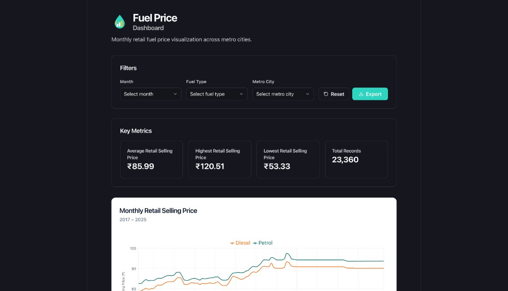

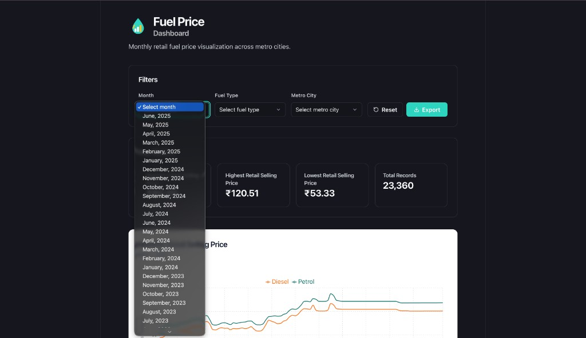

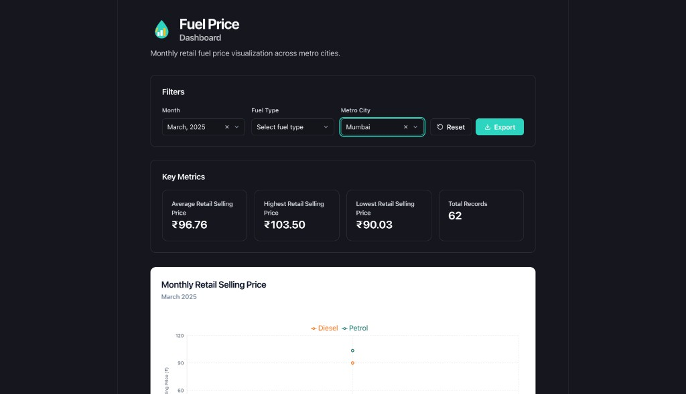

### Charts

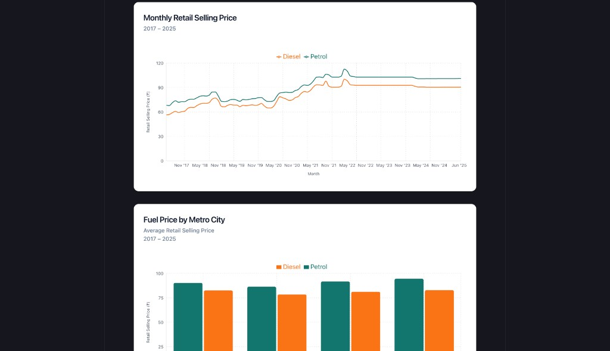

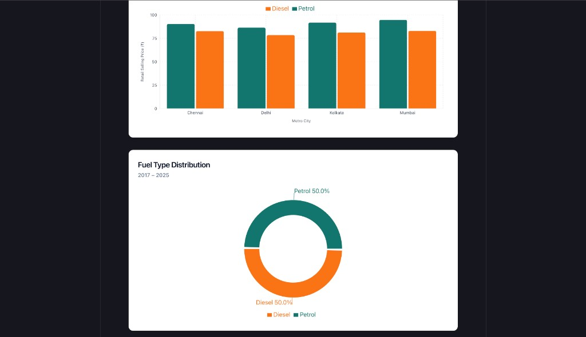

### Mobile

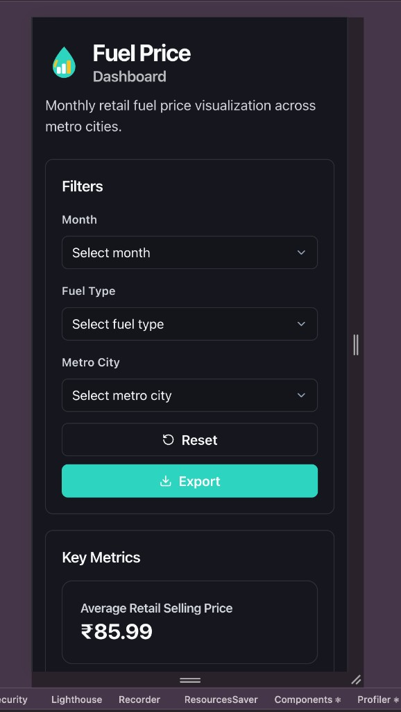

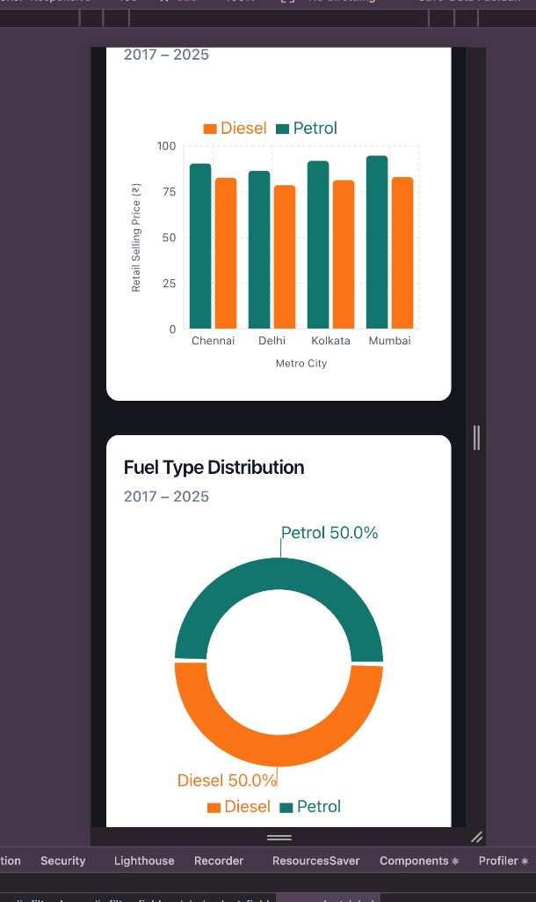

### PDF export

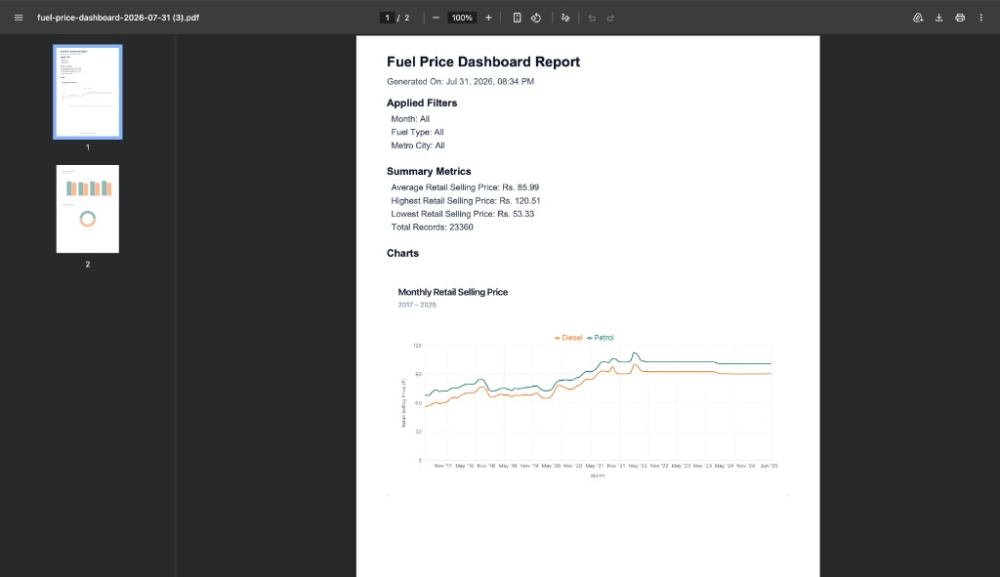

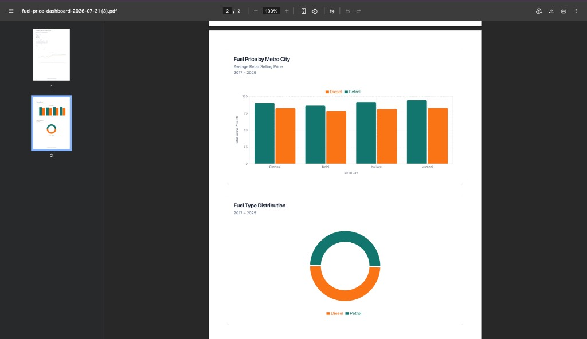

### Toasts

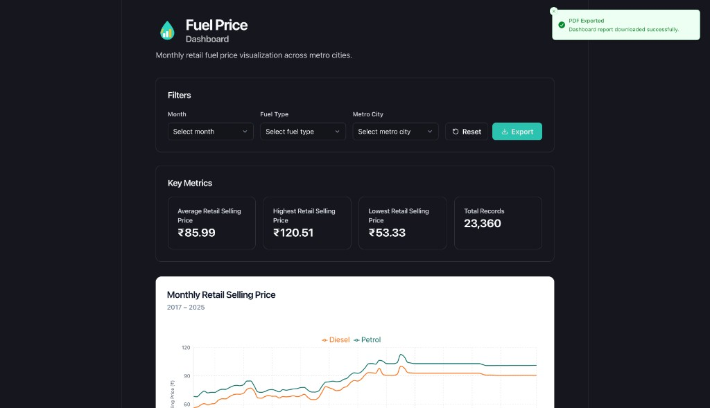

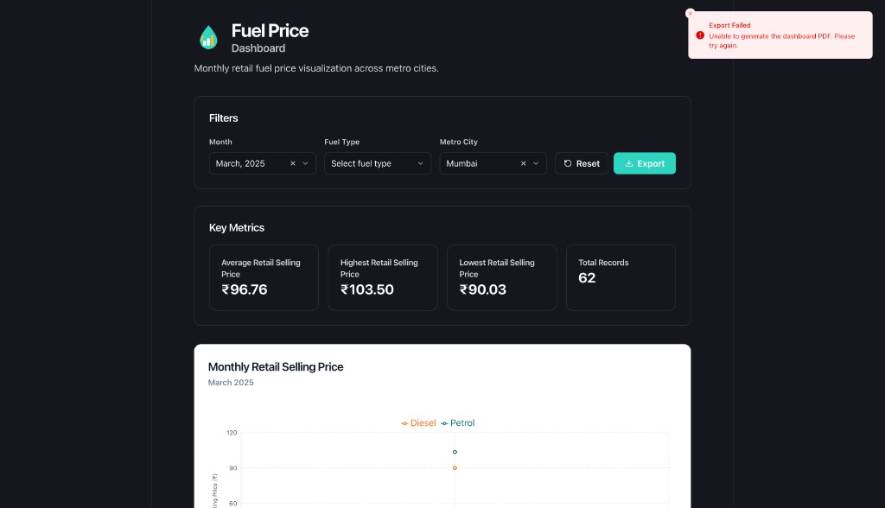

---

## Performance

| | Before | After |
| --- | ---: | ---: |
| Lighthouse Performance (desktop) | 64 | **94** |
| Lighthouse Performance (mobile) | 68 | **99** |
| Lighthouse SEO | 82 | **91** |
| LCP (Chrome Performance) | **6.33s** | **1.62s** |
| CLS | 0 | 0 |

### Lighthouse (desktop)

**Before — Performance 64**

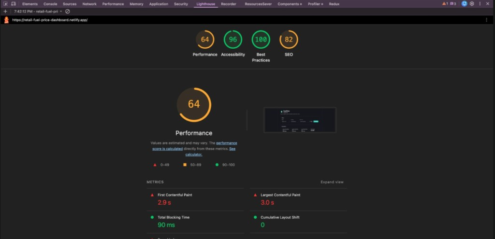

**After — Performance 94**

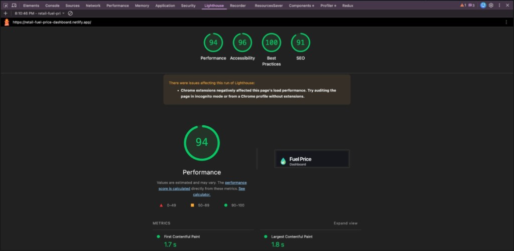

### Lighthouse (mobile)

**Before — Performance 68**

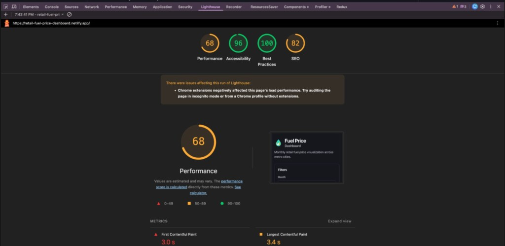

**After — Performance 99**

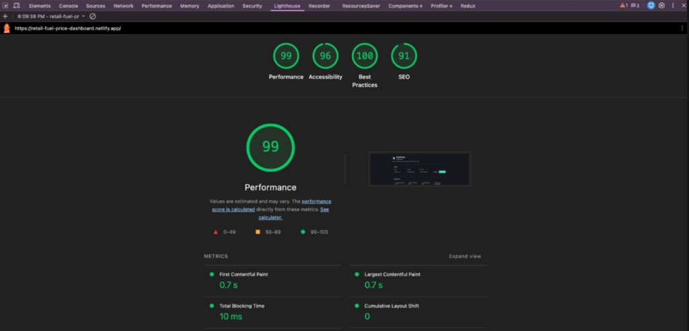

### LCP (Chrome Performance panel)

**Before — LCP 6.33s**

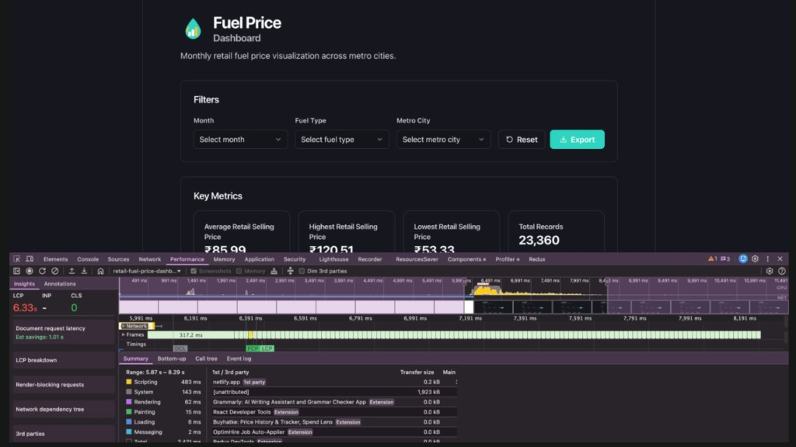

**After — LCP 1.62s**

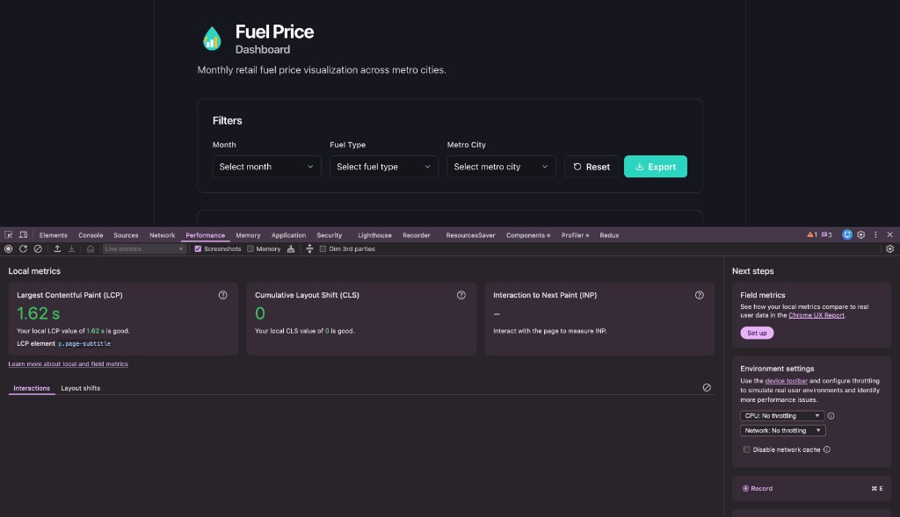

**What changed:** CSV moved to `public/` and fetched async · charts lazy-loaded · PDF code loaded only on Export · memoized filtered data.

---

## Run locally

```bash
git clone https://github.com/paruljamwal/fuel-price-dashboard.git
cd fuel-price-dashboard
npm install
npm run dev
```

```bash
npm run build
npm run preview
```

Node 22+ recommended.

---

## Project structure

```text
src/
  components/     # UI + charts
  utils/          # data, charts, PDF
  types/
public/data/      # CSV (fetched at runtime)
```

More detail: [APPROACH.md](./APPROACH.md)

---

## Deployment

Hosted on **Netlify** → [retail-fuel-price-dashboard.netlify.app](https://retail-fuel-price-dashboard.netlify.app)

- Build: `yarn build` / `npm run build`
- Publish: `dist`
- Node: 22 (`netlify.toml`)

---

## Author

**Parul Jamwal** · Frontend Developer

- GitHub: [paruljamwal](https://github.com/paruljamwal)
- Repo: [fuel-price-dashboard](https://github.com/paruljamwal/fuel-price-dashboard)
- Demo: [Netlify](https://retail-fuel-price-dashboard.netlify.app)
